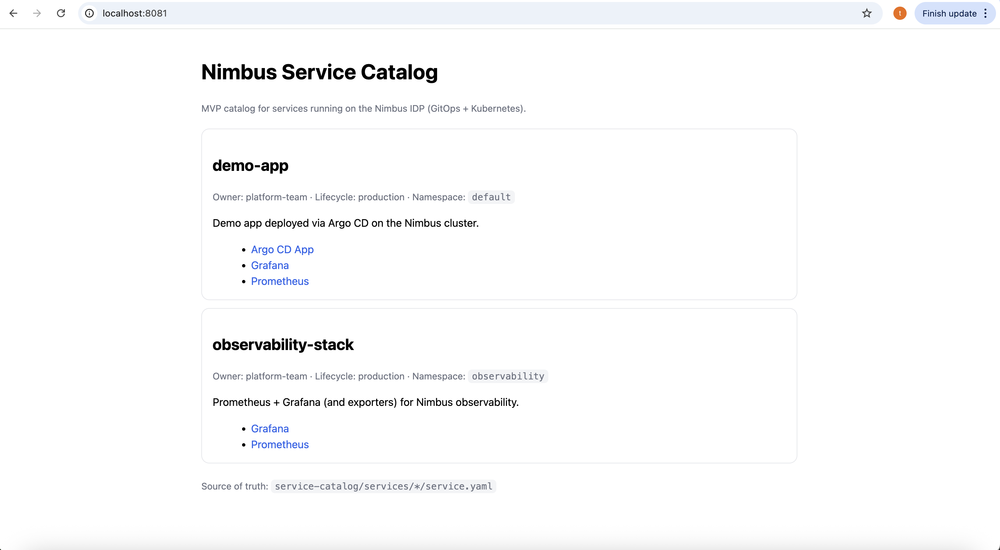

# Nimbus IDP

Nimbus is a lightweight **Internal Developer Platform (IDP)** built on Kubernetes and GitOps.  
It brings deployments, observability, and service discovery into a single, opinionated platform.

Nimbus does **not** replace existing tools.  
It connects and standardizes them.

---

## What Nimbus Is

Nimbus provides:
- A **GitOps-based delivery platform**
- A **read-only Service Catalog** for visibility
- **Built-in observability** using Prometheus & Grafana
- A **single operational flow** for developers and platform teams

Nimbus is designed to scale from:
- Local / single-node k3s
- To managed Kubernetes (EKS, GKE, AKS)

---

## Platform Principles

- Kubernetes-first  
- Git as the single source of truth  
- Opinionated defaults over flexibility  
- Visibility over abstraction  
- No custom control planes  

---

## Core Components
D
Nimbus is built around Kubernetes and GitOps, bringing deployment and
observability into a single platform.

Core components:

- Kubernetes (k3s) as the runtime platform
- Argo CD for GitOps-based continuous delivery
- Prometheus for metrics collection
- Grafana for dashboards and visualization
- GitHub Actions for CI
- Traefik Ingress for traffic routing

---
## Nimbus Architecture

Nimbus follows a GitOps-driven platform architecture built on Kubernetes.

📐 **Nimbus architecture diagram:**  
👉 [View Nimbus Architecture](docs/architecture.md)

This diagram shows how:
- Developers push code to GitHub
- CI pipelines build and update manifests
- Argo CD synchronizes desired state to Kubernetes
- Applications and observability run on the cluster
- The Nimbus Service Catalog provides a single discovery layer

---
## Architecture

Nimbus is built as a lightweight Internal Developer Platform using a layered architecture.

**Layers:**

- **Infrastructure Layer**
  - AWS EC2 hosts the Kubernetes (k3s) cluster.
  - This layer is abstracted away from application developers.

- **Platform Layer**
  - Kubernetes provides the execution environment.
  - Argo CD acts as the GitOps control plane, syncing desired state from Git.
  - Traefik handles ingress traffic into the cluster.

- **Observability Layer**
  - Prometheus collects metrics from nodes and Kubernetes components.
  - Grafana visualizes metrics through predefined dashboards.

- **Service Catalog**
  - Service metadata is stored in Git under `service-catalog/`.
  - Each service entry defines ownership, lifecycle, Git source, Kubernetes resources, and operational links.

====
| Component | Purpose |
|---------|--------|
| Kubernetes (k3s) | Runtime platform |
| Argo CD | GitOps continuous delivery |
| GitHub Actions | CI (build & manifest updates) |
| Prometheus | Metrics collection |
| Grafana | Metrics visualization |
| Traefik Ingress | Traffic routing |
| Nimbus Service Catalog | Service discovery & visibility |

---

## High-Level Flow (Nimbus in Action)

1. Developers push code to GitHub  
2. GitHub Actions builds images and updates manifests  
3. Argo CD detects changes and syncs to Kubernetes  
4. Applications run on the cluster  
5. Prometheus collects metrics  
6. Grafana visualizes system health  
7. Services are documented in the Nimbus Service Catalog  

Git remains the **single source of truth**.

---

## Dashboards

Nimbus exposes operational visibility through existing platform tools.  
There is no custom dashboard logic — dashboards *are* the interface.

---

### Argo CD — Deployments & GitOps

Argo CD provides:
- Application sync status
- Deployment history
- Drift detection
- Rollbacks

**Access:**
- URL: http://localhost:8080  
- Navigate to **Applications**

Example applications:
- `demo-app`
- `service-catalog`
- `observability-stack`

---

### Grafana — Metrics & Observability

Grafana provides visibility into:
- Node resource usage
- Kubernetes workloads
- Network and pod metrics

**Access:**
- URL: http://localhost:3000  
- Data source: Prometheus  

Recommended dashboards:
- Node Resource Overview  
- Kubernetes / Workload  
- Kubernetes / Networking / Pod  

---

### Prometheus — Metrics Backend

Prometheus is used strictly for metrics collection.

**Access (optional):**
- URL: http://localhost:9090  

Prometheus is **not intended for direct developer usage**.

---

## Nimbus Service Catalog


Nimbus includes a lightweight **Service Catalog** that provides a single place to discover services running on the platform.

The Service Catalog is:
- Git-backed (YAML as the source of truth)
- Auto-updated via GitOps
- Read-only for developers
- Focused on visibility, not provisioning

### Service Catalog UI

The Nimbus Service Catalog UI provides a simple, read-only view of services running on the platform, with direct links to operational tooling.



---

### Example Services

#### demo-app

- Owner: platform-team  
- Lifecycle: production  
- Namespace: default  

Demo application deployed via Argo CD.

Links:
- Argo CD App  
- Grafana  
- Prometheus  

---

#### observability-stack

- Owner: platform-team  
- Lifecycle: production  
- Namespace: observability  

Prometheus and Grafana stack used for Nimbus observability.

Links:
- Grafana  
- Prometheus  

---

### Source of Truth

All services are defined in:

```text
service-catalog/services/*/service.yaml
